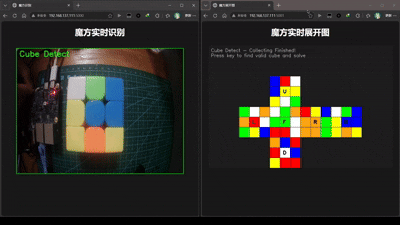
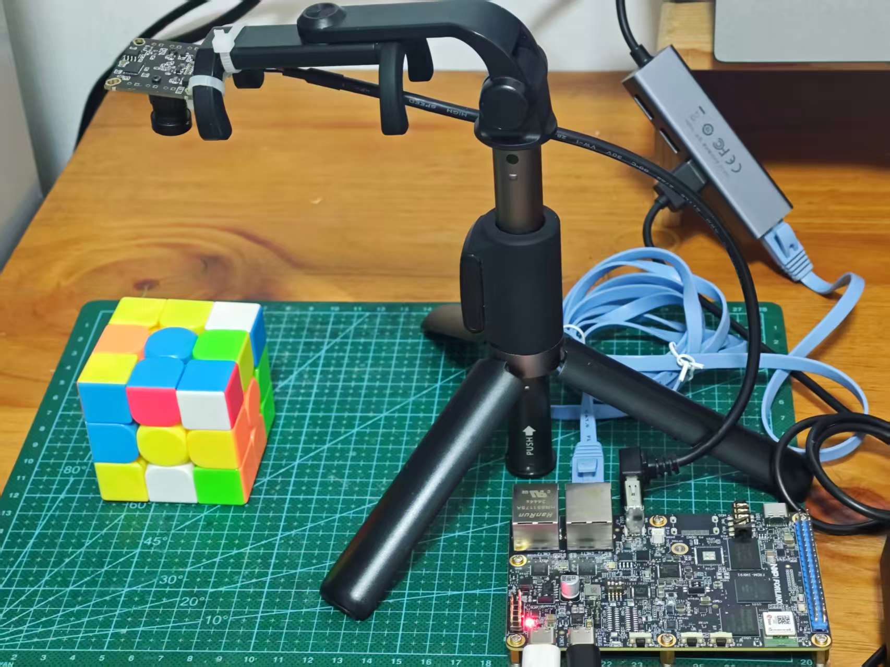
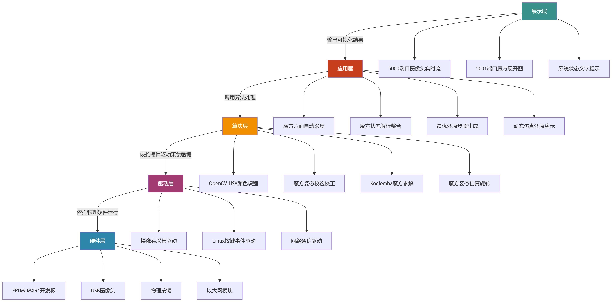
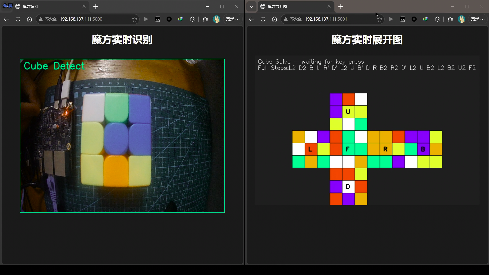

# 三阶魔方可视化识别与求解

## 1、项目介绍


本项目为基于**NXP FRDM\-IMX91嵌入式开发板**搭建的三阶魔方识别与求解系统。项目依托OpenCV视觉处理技术、Kociemba魔方求解算法、多线程并发编程及Flask Web推流技术，实现魔方六面自动采集、颜色智能识别、魔方合法状态校验、最优还原步骤求解、魔方姿态可视化、远程实时监控等全闭环功能。

环境依赖
```
opencv-python
numpy
flask
kociemba
magiccube
```

系统无需上位机辅助，完全在IMX91嵌入式Linux平台本地运算，通过开发板物理按键控制整套流程，同时开启双Web视频流服务，支持局域网内浏览器远程查看摄像头实时画面与魔方展开仿真图。
## 2、硬件介绍包含方案核心器件介绍

- **FRDM\-IMX91**：是NXP推出的高性能嵌入式工业级开发板，基于Linux系统架构，具备优异的边缘算力、低功耗特性和丰富的外设接口。

- **USB高清摄像头**：640×480分辨率，负责实时采集魔方画面，支持Linux系统即插即用，满足近距离高精度色块识别需求。




## 3、整体设计思路
### 系统功能框图
本系统采用分层架构设计，从硬件底层到上层应用展示逐级递进，模块解耦、层级清晰，以下为系统功能框图：



### 软件运行流程图

系统软件流程采用串行闭环逻辑，结合多线程后台常驻运行，整体流程清晰、逻辑严谨，具体软件运行流程图如下：


### 效果演示

系统启动后自动初始化摄像头，加载默认或历史颜色标定参数。用户通过物理按键逐次采集魔方六个面，程序自动分割每面3×3色块区域，识别对应颜色并绑定魔方面属性。六面采集完成后，系统自动遍历魔方旋转姿态，校验合法可解状态，调用算法生成最优还原步骤，随后逐步骤模拟魔方旋转，动态更新可视化画面，最终完成魔方还原演示，支持按键重置重复运行。




